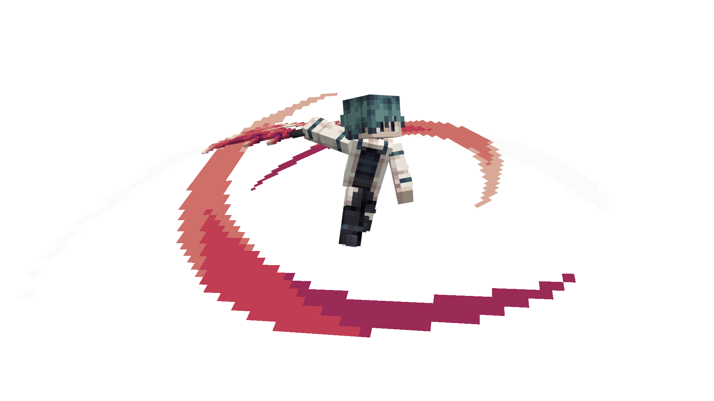

!!! note
    This plugin is still under development. Features and configurations may change in the future as new functionality is added.

# Introduction

ItemCaster is a free alternative to plugins like [MythicCrucible](https://mythiccraft.io/index.php?resources/crucible-custom-items-armor-furniture-blocks-more.2/) or [MMOItems](https://www.spigotmc.org/resources/mmoitems.39267/). and has more customization for users.

---

## Installation

1. Install plugin MythicMobs, NBTAPI, ItemCaster.
2. Upload the jars file to `plugins/`.
3. Run Server.

## Simple Usage Example

To begin, create a generic MythicMobs item. [You can refer to the official MythicMobs item guide here](https://git.mythiccraft.io/mythiccraft/MythicMobs/-/wikis/Items/Items).

Then configure your item like this:

```yaml title="MythicMobs/items/Example_Item.yml"
Example_Item:
  Id: STICK
  Abilities:
  - skill: SummonSkeleton
    activator: LEFT_CLICK
```

As shown above, the `Abilities` section defines the skill and the trigger (in this case, `left_click`) for the item.

For List of Activator, you can see it in [here](./user/activator-list.md).

## The Usage Example 

This is example usage of this plugin, Casting Mythicmobs Skill with Item.

The skill is created by [:simple-discord: KiKo](https://discordlookup.com/user/794739262917967912)

<video controls>
	<source src="assets/videos/usage_example.mp4" type="video/mp4">
</video>

---

Older Version for this Wiki is in this repository [`Phanisment/Item-Caster`](https://github.com/Phanisment/Item-Caster/wiki)