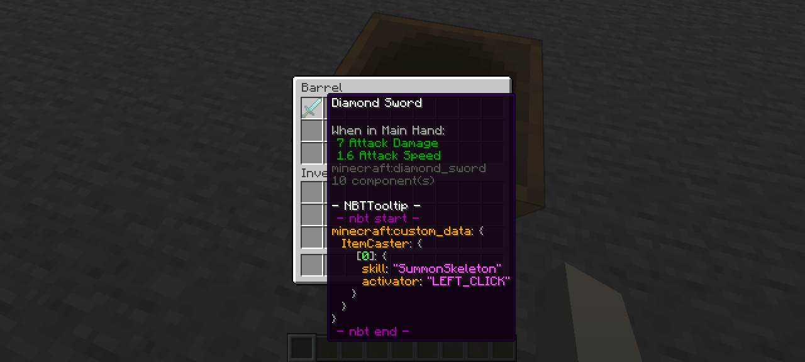

You can integrate **ItemCaster** abilities directly into **Minecraft Datapacks**, allowing you to assign skills and activators to items via loot tables using custom NBT data.

This method is useful for distributing pre-configured items through loot chests, commands, or other loot-related mechanics.

## How It Works

ItemCaster reads a special NBT tag on items called `ItemCaster`. This tag must contain a **JSON array of ability data**, each with a valid `skill` and `activator`.

To use this in a datapack, use the `minecraft:set_custom_data` function inside a loot table, like the example below.

## Example Loot Table Entry

```json
{
  "pools": [
    {
      "rolls": 1,
      "entries": [
        {
          "type": "minecraft:item",
          "name": "minecraft:diamond_sword",
          "functions": [
            {
              "function": "minecraft:set_custom_data",
              "tag": {
                "ItemCaster": [ 
                  {
                    "skill": "SummonSkeleton",
                    "activator": "LEFT_CLICK"
                  }
                ]
              }
            }
          ]
        }
      ]
    }
  ]
}
```

For full structure nbt type you can [see it in here](../nbt-structure.md)

### Explanation
`skill`: The registered skill name from your MythicMobs.

`activator`: The trigger used to activate the skill (e.g., `LEFT_CLICK`, `RIGHT_CLICK`, `DAMAGED`, etc).

You can add multiple skills in the array to attach multiple abilities to the same item:
```json
"ItemCaster": [
  {
    "skill": "SummonSkeleton",
    "activator": "LEFT_CLICK"
  },
  {
    "skill": "HealNearby",
    "activator": "RIGHT_CLICK"
  }
]
```

### Supported Attributes
All additional attributes like cooldown, condition, trigger, etc., can also be defined inside each ability object.

For the full list of available attributes and how to use them, check: [Attributes](../attributes/index.md)

## Helpful Tools
To help you create datapack loot tables easily, you can use the following tool: [Misode Loot Table Generator](https://misode.github.io/loot-table/)

## How to get

Install the datapack in bellow and execute this command.

```
/loot give @s loot itemcaster:example_item
```

## Download Full Example
To get started quickly, you can download the full example datapack below:

[ :material-download: Download ](../../assets/example/datapack-integration.zip){:download .md-button}